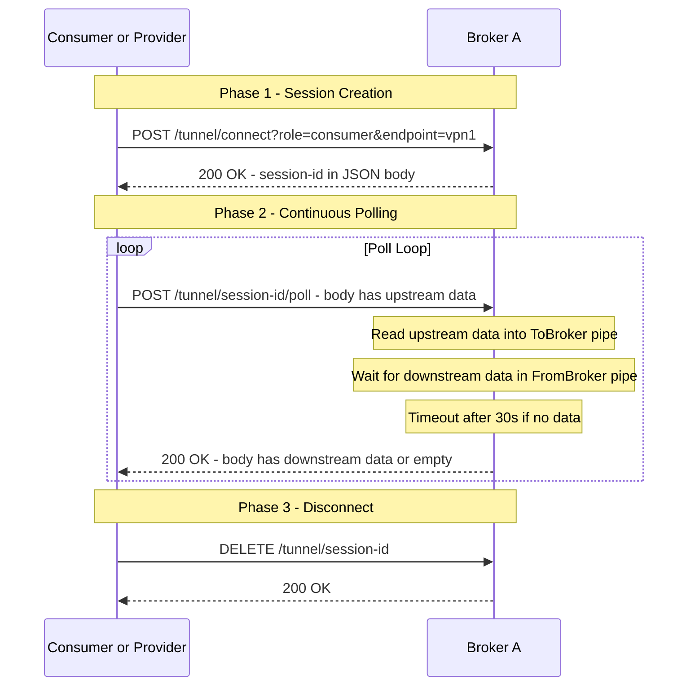
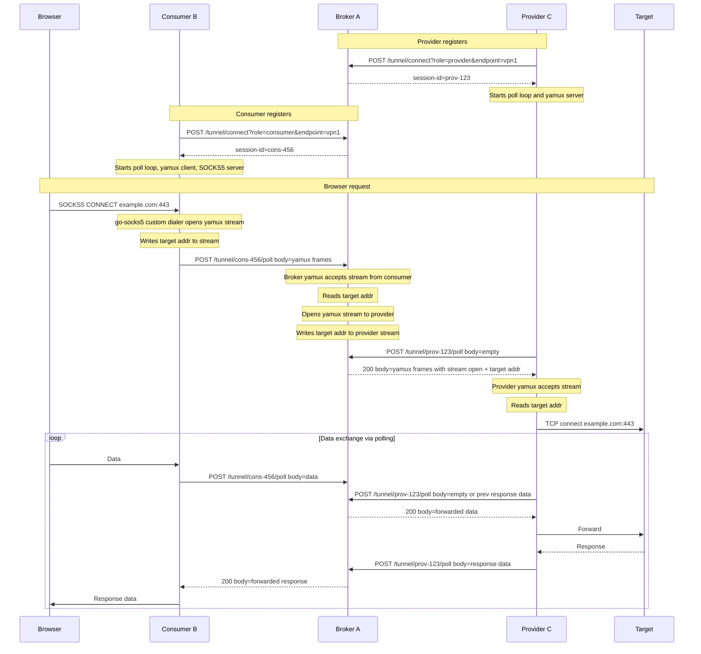

# HttpBroker - Architecture Plan

## Overview

HttpBroker is a three-node proxy network application written in **Go**. It creates a TCP tunnel that allows a machine (Consumer/B) to access network resources available only to another machine (Provider/C), relayed through a central broker (Server/A).

All traffic between nodes uses **pure HTTP long-polling** — every interaction is a standard HTTP POST request/response. No WebSocket, no persistent connections, no separate download channels. The traffic is indistinguishable from a normal web application.

```
┌─────────────┐            ┌─────────────┐            ┌─────────────┐
│  Machine B  │            │  Machine A  │            │  Machine C  │
│  (Consumer) │◄──HTTP/S──►│  (Broker)   │◄──HTTP/S──►│  (Provider) │
│             │            │             │            │             │
│ SOCKS5 :1080│            │ HTTP/S      │            │ Dials target│
│ Browser ──► │ ─────────► │ :8080       │ ─────────► │ host:port   │
│             │ ◄───────── │             │ ◄───────── │             │
└─────────────┘            └─────────────┘            └─────────────┘
     VPN Network             Shared Network             Target Network
```

## Design Decisions

| Decision | Choice | Rationale |
|----------|--------|-----------|
| Language | Go | Small binary, low memory for RPi, excellent networking, goroutines |
| Transport | Pure HTTP long-polling | Single POST request serves as both upload and download; looks like normal API calls |
| Future transport | HTTP/2 streams | Placeholder interface for future; lower latency |
| Local proxy on B | `things-go/go-socks5` | Mature SOCKS5 library with custom dialer support |
| Multiplexing | `hashicorp/yamux` | Stream mux over virtual HTTP connection |
| Configuration | YAML + CLI flags | Simple, human-readable |
| Auth | Middleware placeholder | No auth now, extensible for token auth later |

## HTTP Transport Design

### Pure Long-Polling Model

Each interaction between client (B or C) and broker (A) is a single HTTP POST:

```
Client                                    Broker
  │                                         │
  │  POST /tunnel/{session-id}/poll         │
  │  Body: [upstream data, may be empty]    │
  │ ──────────────────────────────────────► │
  │                                         │  1. Broker reads upstream data from body
  │                                         │  2. Broker waits for downstream data
  │                                         │     (up to poll_timeout, e.g. 30s)
  │                                         │  3. Returns downstream data in response
  │  200 OK                                 │
  │  Body: [downstream data, may be empty]  │
  │ ◄────────────────────────────────────── │
  │                                         │
  │  (immediately sends next POST)          │
  │                                         │
```

**Key properties:**
- **Single request type**: Every poll is a POST that carries upload data AND receives download data
- **Bidirectional**: Request body = upstream, response body = downstream
- **Long-poll**: Server holds the response until data is available or timeout
- **Looks normal**: To any observer, this is just a web app making API calls
- **Slightly higher latency**: Data can only flow downstream when client polls; acceptable tradeoff

### Session Lifecycle



### What Network Traffic Looks Like

To a network observer:
- Regular HTTP POST requests to `/tunnel/xxx/poll` — looks like an API polling endpoint
- Some responses are fast (data available), some take up to 30s (long-poll, common pattern)
- Request and response bodies contain opaque binary data (or base64 if needed)
- If using HTTPS: completely opaque encrypted traffic
- Indistinguishable from a web app using AJAX polling

### HTTP Endpoints on Broker

| Method | Path | Purpose |
|--------|------|---------|
| POST | `/tunnel/connect` | Create a new tunnel session; query params: `role`, `endpoint` |
| POST | `/tunnel/{session-id}/poll` | Poll: upload data in body, receive downstream data in response |
| DELETE | `/tunnel/{session-id}` | Close session |
| GET | `/status` | Health check and endpoint listing |

### Virtual Connection Implementation

The `HTTPConn` wraps the polling loop as an `io.ReadWriteCloser` for yamux:

```go
// HTTPConn implements io.ReadWriteCloser over HTTP long-polling.
// Write() buffers data; the poll goroutine sends it as POST body.
// Read() returns data received from poll responses.
type HTTPConn struct {
    sessionID   string
    brokerURL   string
    httpClient  *http.Client
    
    // Write side: data buffered for next poll's request body
    writeBuf    bytes.Buffer
    writeMu     sync.Mutex
    writeSignal chan struct{}   // signals that new write data is available
    
    // Read side: data received from poll responses
    readBuf     bytes.Buffer
    readMu      sync.Mutex
    readSignal  chan struct{}   // signals that new read data is available
    
    closed      int32          // atomic
}
```

**Poll goroutine logic:**
1. Collect any pending write data from `writeBuf`
2. Send POST with write data as body (empty body if no data)
3. Wait for response
4. Put response body data into `readBuf`, signal readers
5. Repeat immediately

**`Read(p []byte)`**: Blocks until `readBuf` has data, then returns it.
**`Write(p []byte)`**: Appends to `writeBuf`, signals poll goroutine.

On the **broker side**, each session has a server-side virtual connection:

```go
// Session on the broker side
type Session struct {
    ID         string
    Role       string           // "consumer" or "provider"
    Endpoint   string
    ToBroker   *BufferedPipe    // client POST body → broker reads
    FromBroker *BufferedPipe    // broker writes → client poll response
    LastActive time.Time
}
```

The poll HTTP handler:
1. Read request body → write to `ToBroker` pipe
2. Read from `FromBroker` pipe (block up to 30s)
3. Write available data as response body
4. Return 200

The `Session` also implements `io.ReadWriteCloser`:
- `Read()` reads from `ToBroker` (data the client sent)
- `Write()` writes to `FromBroker` (data to send to client)

This allows yamux to run on top of the session.

## Full Data Flow



## Project Structure

```
HttpBroker/
├── cmd/
│   ├── broker/              # Machine A - Broker server
│   │   └── main.go
│   ├── consumer/            # Machine B - Consumer with SOCKS5
│   │   └── main.go
│   └── provider/            # Machine C - Provider with network access
│       └── main.go
├── internal/
│   ├── transport/           # HTTP transport layer
│   │   ├── httpconn.go      # Client-side: virtual conn over HTTP polling
│   │   ├── httpconn_test.go
│   │   ├── session.go       # Server-side: session with buffered pipes
│   │   ├── pipe.go          # Thread-safe buffered pipe with blocking read
│   │   ├── pipe_test.go
│   │   └── transport.go     # Transport interface for future HTTP/2
│   ├── broker/              # Broker server logic
│   │   ├── server.go        # HTTP/HTTPS server, tunnel API handlers
│   │   ├── endpoint.go      # Endpoint registry: one provider, N consumers
│   │   ├── relay.go         # yamux session mgmt, stream bridging
│   │   └── middleware.go    # Auth middleware placeholder
│   ├── consumer/            # Consumer client logic
│   │   ├── client.go        # HTTPConn + yamux + SOCKS5 setup
│   │   └── dialer.go        # Custom SOCKS5 dialer via yamux streams
│   ├── provider/            # Provider client logic
│   │   ├── client.go        # HTTPConn + yamux, accept streams
│   │   ├── handler.go       # Read target addr, dial target, bridge
│   │   └── scrubber.go      # HTTP header scrubbing
│   └── config/              # Configuration
│       └── config.go        # YAML config + CLI flag parsing
├── configs/
│   ├── broker.yaml          # Sample broker config
│   ├── consumer.yaml        # Sample consumer config
│   └── provider.yaml        # Sample provider config
├── go.mod
├── go.sum
├── Makefile                 # Build targets
└── README.md
```

## Module Details

### 1. `internal/transport` - HTTP Transport Layer

- [`transport.go`](internal/transport/transport.go) — `Transport` interface:
  ```go
  type Transport interface {
      // Client side: connect to broker, return virtual conn
      Connect(brokerURL, sessionID string) (io.ReadWriteCloser, error)
  }
  ```
  Allows swapping HTTP/1.1 polling for HTTP/2 in the future.

- [`httpconn.go`](internal/transport/httpconn.go) — `HTTPConn` client-side virtual connection:
  - Background poll goroutine: continuously POSTs to `/tunnel/{id}/poll`
  - Each POST carries buffered write data, receives read data
  - Implements `io.ReadWriteCloser` for yamux
  - Handles connection errors, timeouts, and shutdown

- [`session.go`](internal/transport/session.go) — `Session` server-side virtual connection:
  - Two `BufferedPipe`s for bidirectional data flow
  - Poll HTTP handler reads from request body, writes to response body
  - Implements `io.ReadWriteCloser` for broker's yamux session
  - Tracks last activity for session cleanup

- [`pipe.go`](internal/transport/pipe.go) — `BufferedPipe`:
  - Thread-safe byte buffer with blocking read
  - `Write(data)` — appends data, wakes blocked readers
  - `Read(buf)` — blocks until data available or context cancelled
  - `ReadTimeout(buf, timeout)` — for long-poll handler (returns what's available after timeout)

### 2. `internal/broker` - Broker Server (Machine A)

- [`server.go`](internal/broker/server.go) — HTTP server:
  - `POST /tunnel/connect` — validates role/endpoint, creates session, starts yamux, returns session ID
  - `POST /tunnel/{id}/poll` — poll handler: writes request body to session pipe, reads response from session pipe with timeout
  - `DELETE /tunnel/{id}` — closes session and yamux
  - `GET /status` — lists endpoints and their status
  - Supports both HTTP and HTTPS (TLS config)

- [`endpoint.go`](internal/broker/endpoint.go) — `EndpointRegistry`:
  - `map[string]*Endpoint` protected by `sync.RWMutex`
  - `Endpoint` struct: provider `*Session` + yamux session, consumer `map[string]*Session` + yamux sessions
  - Methods: `RegisterProvider()`, `RegisterConsumer()`, `RemoveSession()`

- [`relay.go`](internal/broker/relay.go) — Stream relay:
  - For each consumer yamux session: goroutine loop calling `session.Accept()`
  - On new stream: read target address, find provider, open stream to provider yamux, write target address, bridge with bidirectional `io.Copy`
  - Handles stream errors and cleanup

- [`middleware.go`](internal/broker/middleware.go) — Auth placeholder:
  - `Authenticator` interface with `Authenticate(r *http.Request) error`
  - `NoopAuthenticator` implementation (always passes)
  - Wraps HTTP handlers for future token auth

### 3. `internal/consumer` - Consumer Client (Machine B)

- [`client.go`](internal/consumer/client.go):
  - Sends `POST /tunnel/connect?role=consumer&endpoint=<name>` to get session ID
  - Creates `HTTPConn` with the session ID
  - Creates yamux client session over `HTTPConn`
  - Configures and starts go-socks5 server with custom dialer
  - Reconnection loop with exponential backoff

- [`dialer.go`](internal/consumer/dialer.go):
  - Implements go-socks5's `Dialer` interface
  - `Dial(ctx, network, addr)`:
    - Opens new yamux stream via `session.Open()`
    - Writes length-prefixed target address: `[1 byte len][host:port]`
    - Returns the yamux stream as `net.Conn`
    - go-socks5 then bridges browser connection ↔ this stream

### 4. `internal/provider` - Provider Client (Machine C)

- [`client.go`](internal/provider/client.go):
  - Sends `POST /tunnel/connect?role=provider&endpoint=<name>` to get session ID
  - Creates `HTTPConn` with the session ID
  - Creates yamux server session over `HTTPConn`
  - Loops: `session.Accept()` → handle in goroutine
  - Reconnection loop with exponential backoff

- [`handler.go`](internal/provider/handler.go):
  - Reads length-prefixed target address from stream
  - Dials target `host:port` via `net.DialTimeout`
  - If scrubbing enabled, wraps with `ScrubWriter`
  - Bridges: `io.Copy(targetConn, stream)` and `io.Copy(stream, targetConn)` in two goroutines
  - Closes both when either direction finishes

- [`scrubber.go`](internal/provider/scrubber.go):
  - `ScrubWriter` wraps `io.Writer`
  - On first write, inspects bytes:
    - If starts with HTTP method (GET, POST, etc.): buffer until headers complete, parse, remove proxy headers, flush modified request
    - If starts with 0x16 (TLS ClientHello): pass through, disable scrubbing for this stream
    - Otherwise: pass through
  - After first request, passes through all subsequent data (only first request needs scrubbing)

### 5. `internal/config` - Configuration

- [`config.go`](internal/config/config.go):
  - `BrokerConfig`, `ConsumerConfig`, `ProviderConfig` structs
  - `LoadConfig(path string, cfg interface{})` using viper
  - CLI flag binding using cobra

## Configuration Examples

### Broker (Machine A) - `broker.yaml`
```yaml
server:
  listen: ":8080"
  tls:
    enabled: false
    cert_file: ""
    key_file: ""

tunnel:
  poll_timeout: "30s"       # How long to hold poll before empty response
  session_timeout: "5m"     # Cleanup inactive sessions after this

auth:
  enabled: false
  # token: "secret-token"   # Future use

logging:
  level: "info"
```

### Consumer (Machine B) - `consumer.yaml`
```yaml
broker:
  url: "http://192.168.1.100:8080"
  endpoint: "vpn1"

socks5:
  listen: ":1080"

transport:
  poll_interval: "50ms"     # Min interval between polls
  retry_backoff: "5s"       # Initial reconnection backoff

logging:
  level: "info"
```

### Provider (Machine C) - `provider.yaml`
```yaml
broker:
  url: "http://192.168.1.100:8080"
  endpoint: "vpn1"

provider:
  scrub_headers: true
  dial_timeout: "10s"

transport:
  poll_interval: "50ms"
  retry_backoff: "5s"

logging:
  level: "info"
```

## Go Dependencies

| Package | Purpose |
|---------|---------|
| `github.com/hashicorp/yamux` | Stream multiplexing over virtual HTTP connection |
| `github.com/things-go/go-socks5` | SOCKS5 server with custom dialer |
| `github.com/gorilla/mux` | HTTP router for broker API |
| `github.com/spf13/cobra` | CLI command framework |
| `github.com/spf13/viper` | Configuration management |
| `go.uber.org/zap` | Structured logging |
| Standard library | `net/http`, `net`, `io`, `sync`, `bytes`, `encoding/json` |

## Key Implementation Considerations

### Poll Loop Timing
- When data is flowing (active browsing): polls return immediately with data, next poll sent immediately
- When idle: polls timeout after 30s with empty response, client re-polls
- `poll_interval` (50ms) prevents tight-looping when there's constant data
- Effective latency during active use: ~50ms (one poll round-trip)

### yamux Keepalives
- yamux sends periodic keepalive pings
- These become small POST requests in the poll loop
- Keeps the session alive on the broker side
- Configure yamux keepalive interval to be less than broker's session_timeout

### Broker Poll Handler - Critical Path & Keepalive
```
1. Read request body (upstream data from client)
2. If body not empty: write to session.ToBroker pipe
3. Try to read from session.FromBroker pipe:
   a. If data available immediately: return it in 200 response
   b. If no data: block up to poll_timeout (30s)
   c. If timeout with no data: return 204 No Content (empty response body)
4. Client receives response (200 with data OR 204 empty)
5. Client IMMEDIATELY sends next POST /poll request
```

**Keepalive guarantee:** The server ALWAYS responds within `poll_timeout` (default 30s), even if there is no data to send. This ensures:
- The HTTP connection never hangs indefinitely
- The client always has a pending request or is about to send one
- Network intermediaries (proxies, load balancers) don't timeout the connection
- The session stays alive on the broker (each poll updates `LastActive`)
- yamux keepalive pings flow through the poll cycle naturally

**Effective behavior:**
- Active data transfer: polls return instantly with data → near-zero latency
- Idle state: polls return every 30s with empty body → heartbeat pattern
- The cycle never stops until the session is explicitly closed or the client disconnects

### Session Cleanup
- Broker tracks `LastActive` timestamp per session
- Background goroutine runs every minute, removes sessions inactive > session_timeout
- When session removed: close yamux session, close pipes, remove from endpoint registry

### DNS Resolution (Remote DNS)

DNS queries for VPN-internal hostnames must be resolved on the **Provider (C)**, not on the Consumer (B), because only C has access to the VPN's DNS servers.

**How it works in our design:**
1. Browser sends SOCKS5 CONNECT with **domain name** (e.g., `internal-server.vpn.corp:443`)
2. go-socks5 receives the domain name as-is (SOCKS5 supports domain name addressing, RFC 1928 ATYP=0x03)
3. Consumer passes the domain name string through the tunnel to Provider
4. Provider calls `net.Dial("tcp", "internal-server.vpn.corp:443")` — Go resolves DNS **locally on C** using C's DNS configuration (which includes VPN DNS)
5. DNS resolution happens on C → VPN-internal names resolve correctly

**Important: Browser must be configured for remote DNS:**
- **Firefox**: Set `network.proxy.socks_remote_dns = true` in `about:config`
- **Chrome/Chromium**: Use `--host-resolver-rules="MAP * ~NOTFOUND , EXCLUDE 127.0.0.1"` or configure via PAC file
- **curl**: Use `--socks5-hostname` instead of `--socks5` to send domain names

**go-socks5 configuration:**
- Use a custom `NameResolver` that returns the address as-is (no local resolution)
- The default resolver in go-socks5 tries to resolve locally; we must override it to pass domain names through unchanged
- Implementation: `NoopResolver` that returns the original domain name without resolving

```go
// NoopResolver passes domain names through without resolving.
// DNS resolution happens on the Provider side.
type NoopResolver struct{}

func (r *NoopResolver) Resolve(ctx context.Context, name string) (context.Context, net.IP, error) {
    // Return a dummy IP; the actual domain name is passed via the target address header
    // go-socks5 will use our custom Dialer which receives the original domain name
    return ctx, net.IPv4(0, 0, 0, 0), nil
}
```

**Note:** Our custom `Dialer` in the consumer receives the original `host:port` from the SOCKS5 request and passes it through the tunnel. The Provider's `net.Dial` resolves it using C's local DNS. This ensures VPN-internal hostnames work correctly.

### Error Handling
- Provider disconnect: broker closes all consumer yamux streams for that endpoint
- Consumer disconnect: broker cleans up consumer's streams, provider unaffected
- Network errors in poll: client retries with exponential backoff
- Dial failure on provider: yamux stream closed, consumer receives EOF, browser retries

### Concurrency Safety
- `BufferedPipe`: uses `sync.Mutex` + `sync.Cond` for blocking reads
- `EndpointRegistry`: uses `sync.RWMutex`
- `HTTPConn` write buffer: uses `sync.Mutex`
- yamux handles its own internal concurrency

## Implementation Order

1. **`internal/transport/pipe.go`** — BufferedPipe with blocking read and timeout
2. **`internal/transport/session.go`** — Server-side session with pipes
3. **`internal/transport/httpconn.go`** — Client-side virtual connection with poll loop
4. **`internal/transport/transport.go`** — Transport interface
5. **`internal/broker/server.go`** — HTTP server with tunnel API handlers
6. **`internal/broker/endpoint.go`** — Endpoint registry
7. **`internal/broker/relay.go`** — yamux session management and stream bridging
8. **`internal/broker/middleware.go`** — Auth placeholder
9. **`internal/provider/client.go`** — Provider client with HTTPConn + yamux
10. **`internal/provider/handler.go`** — Stream handler: dial target, bridge
11. **`internal/consumer/client.go`** — Consumer client with HTTPConn + yamux + SOCKS5
12. **`internal/consumer/dialer.go`** — Custom SOCKS5 dialer
13. **`internal/provider/scrubber.go`** — HTTP header scrubbing
14. **`internal/config/config.go`** — Configuration loading
15. **`cmd/broker/main.go`** — Broker CLI entry point
16. **`cmd/consumer/main.go`** — Consumer CLI entry point
17. **`cmd/provider/main.go`** — Provider CLI entry point
18. **Testing** — Unit tests for pipe, httpconn; integration test for full tunnel
19. **`Makefile`** — Build targets for all platforms
20. **`README.md`** — Usage documentation
